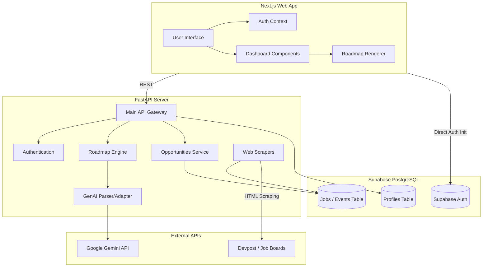
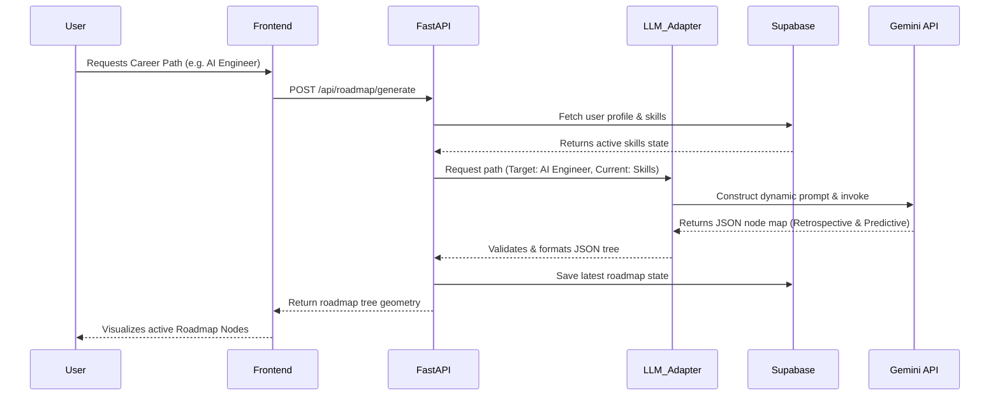

# 5. UML Diagrams

This document contains Mermaid-based UML representations outlining the application architecture and primary workflows.

## 1. System Components Diagram (Architecture)
This outlines high-level technical components interacting across the stack.



## 2. Sequence Diagram: Roadmap Generation Loop



## 3. Use Case Diagram

```mermaid
usecaseDiagram
    actor Student
    actor System as "Automated Scraper"
    
    usecase "Login / Onboard" as UC1
    usecase "View Profile Vault" as UC2
    usecase "Generate Career Path" as UC3
    usecase "Take Adaptive Test" as UC4
    usecase "View Tailored Resume" as UC5
    usecase "View Job Matches" as UC6
    
    usecase "Update Opportunities" as UC7
    
    Student --> UC1
    Student --> UC2
    Student --> UC3
    Student --> UC4
    Student --> UC5
    Student --> UC6
    
    System --> UC7
```
